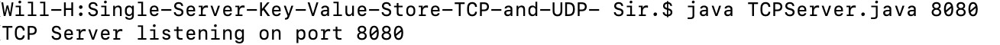
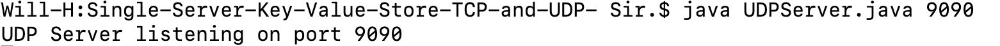
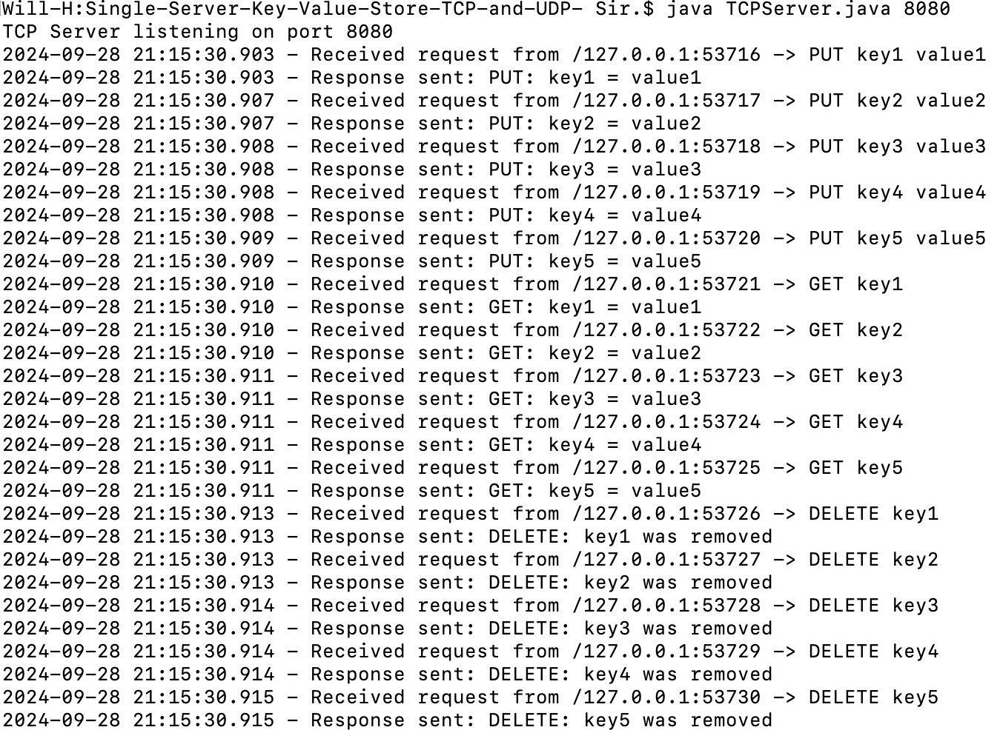
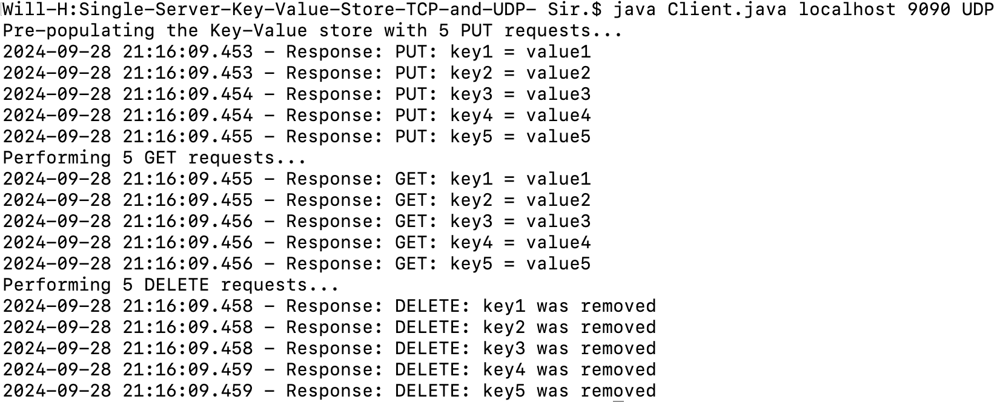
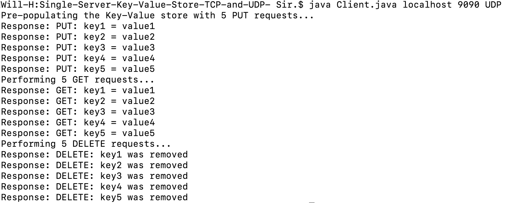
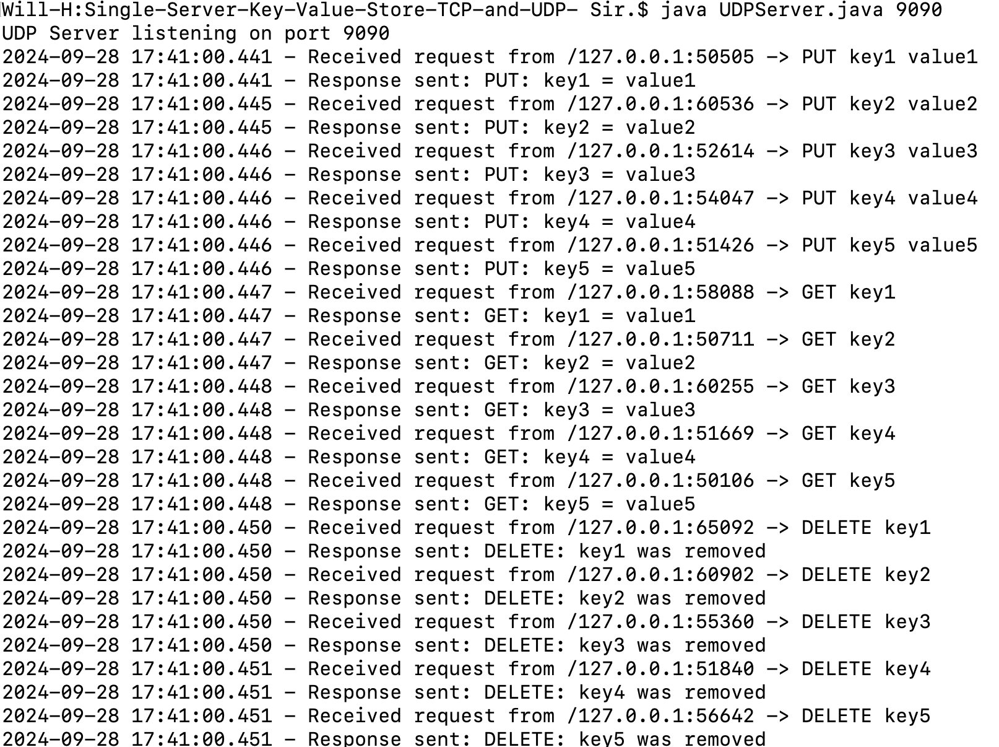
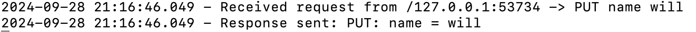
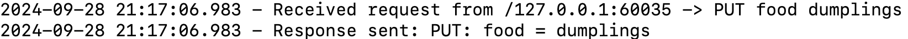
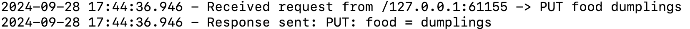

# Single-Server-Key-Value-Store-TCP-and-UDP

1. Running TCP server

2. Running UDP server

3. Running Client to use pre-populated data with TCP:\
Client log:

TCP server log:

4. Running Client to use pre-populated data with UDP:\
Client log:

TCP server log:

5. Running client to use self-defined data with TCP:\
Client log:

TCP server log:

6. Running client to use self-defined data with UDP:\
Client log:

TCP server log:

